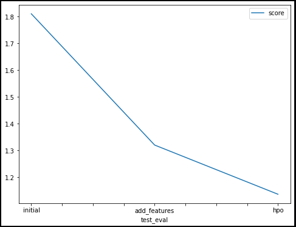

### Bike Sharing Demand Prediction
This project focuses on predicting bike sharing demand using AutoGluon, an automated machine learning library. The goal is to train a model that can accurately forecast the number of bike rentals based on various features such as date, weather conditions, and temperature.

## Getting Started
To get started with this project, follow the steps below:

## Prerequisites
Python 3.x
Install the required packages by running the following commands:
```
!pip install -U pip
!pip install -U setuptools wheel
!pip install -U "mxnet<2.0.0" bokeh==2.0.1
!pip install autogluon --no-cache-dir
```
## Dataset
The project uses the "Bike Sharing Demand" dataset from Kaggle. The dataset contains hourly rental data spanning two years and includes features such as date, season, temperature, humidity, and more. You can download the dataset by running the following command:

```
!kaggle competitions download -c bike-sharing-demand
```
## Training a Model
To train the model using AutoGluon's Tabular Prediction, follow the steps below:

* Load the training data from the train.csv file and preprocess it.
* Set the label to be predicted as "count" and drop unnecessary columns.
* Define the evaluation metric as the root mean squared error (RMSE).
* Use the best_quality preset to focus on creating the best model.
* Train the model using AutoGluon with a time limit of 10 minutes.
* Evaluate the model's performance.
* It leverages AutoGluon's powerful framework to handle data preprocessing, feature engineering, model selection, and hyperparameter optimization.

The model's performance is evaluated using the RMSE metric, which measures the difference between the predicted and actual rental counts. The lower the RMSE, the better the model's performance.

## Results
The trained model achieves a root mean squared error (RMSE) score of approximately 1.81082 on the initial validation data. After adding new features, the model's performance improves to a score of 1.32046. Further hyperparameter optimization results in an even better score of 1.13667.

## Kaggle Score Improvement
A line plot has been created to visualize the improvement in Kaggle scores:


## Model Test Score

The scores for each model are as follows:

* Initial Model: 1.81082
* Model with Added Features: 1.32046
* Model with Hyperparameter Optimization: 1.13667

As seen from the plot, there is a clear improvement in the scores as new features are added and hyperparameter optimization is performed.

## Hyperparameter Tuning
Hyperparameter tuning was performed to further improve the model's performance. The following hyperparameters were chosen:

* use_orig_features: True
* max_base_models: 25
* max_base_models_per_type: 5

These hyperparameters were selected based on experimentation and domain knowledge. By allowing the model to use the original features, leveraging a larger number of base models, and limiting the number of base models per type, we aimed to enhance the model's flexibility and capture more complex patterns in the data.

## Best Model
The best model achieved an RMSE score of 1.13667. It is an ensemble model called "WeightedEnsemble_L2," which combines the predictions of multiple base models to make the final predictions. Ensembling helps to reduce overfitting and improve generalization performance.

## License
[License](This project is licensed under the MIT License.)


